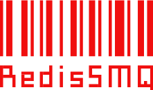

  

  
A simple high-performance Redis message queue for Node.js.

  

    
    
    
  

## RedisSMQ Common Library

This library contains shared components that are used by [RedisSMQ](https://github.com/weyoss/redis-smq) and other applications/extensions of the message queue.

## License

[MIT](https://github.com/weyoss/redis-smq/blob/master/LICENSE)
